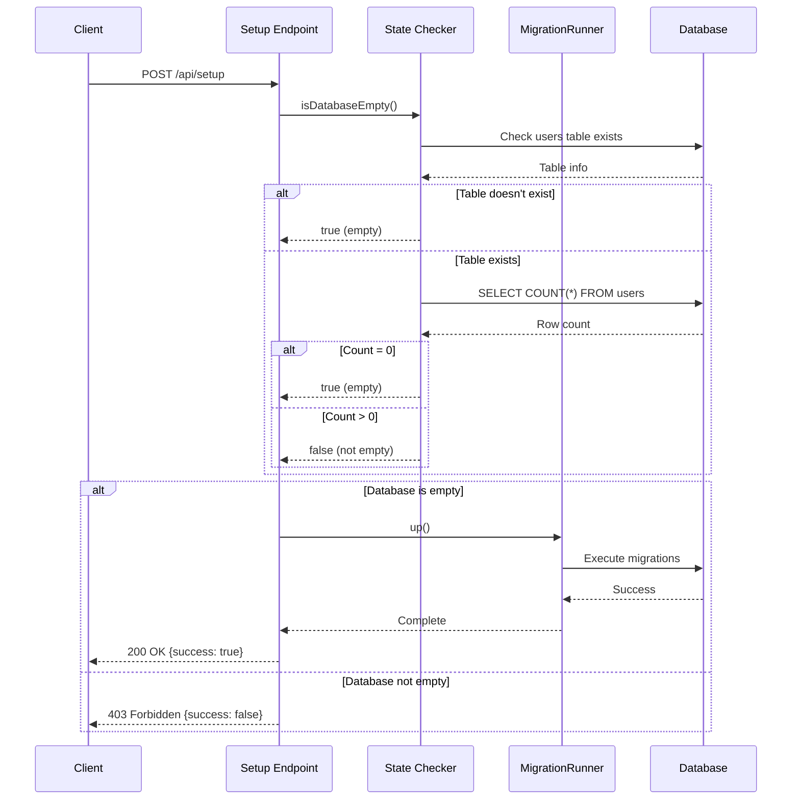

# Design Document: Database Setup Endpoint

## Overview

This feature adds a public HTTP endpoint `/api/setup` that enables database initialization on Render.com without requiring shell access. The endpoint integrates with the existing migration system to create the initial database schema, but only operates on empty databases to prevent accidental data corruption.

The design leverages the existing `MigrationRunner` class and `IDatabase` abstraction layer, ensuring consistency with the application's migration strategy. The endpoint is intentionally unauthenticated to allow initial setup during deployment, but includes safety checks to prevent misuse on populated databases.

Key design principles:
- **Safety First**: Multiple checks ensure the endpoint only runs on empty databases
- **Idempotency**: Repeated calls to an initialized database return consistent error responses
- **Integration**: Reuses existing migration infrastructure without duplication
- **Observability**: Comprehensive logging for troubleshooting deployment issues

## Architecture

### System Context

The setup endpoint sits at the application boundary, providing an HTTP interface to the internal migration system:

```
┌─────────────────────────────────────────────────────────────┐
│                     Express Application                      │
│                                                              │
│  ┌────────────────┐         ┌──────────────────────────┐   │
│  │  POST /api/setup│────────▶│  Setup Endpoint Handler  │   │
│  └────────────────┘         └──────────┬───────────────┘   │
│                                         │                    │
│                                         ▼                    │
│                            ┌────────────────────────┐       │
│                            │ Database State Checker │       │
│                            └────────┬───────────────┘       │
│                                     │                        │
│                                     ▼                        │
│                            ┌────────────────────────┐       │
│                            │   MigrationRunner      │       │
│                            └────────┬───────────────┘       │
│                                     │                        │
│                                     ▼                        │
│                            ┌────────────────────────┐       │
│                            │   IDatabase (SQLite/   │       │
│                            │   PostgreSQL)          │       │
│                            └────────────────────────┘       │
└─────────────────────────────────────────────────────────────┘
```

### Component Responsibilities

**Setup Endpoint Handler**
- Receives POST requests at `/api/setup`
- Orchestrates the setup workflow
- Returns appropriate HTTP responses with JSON payloads
- Handles errors and logs execution status

**Database State Checker**
- Queries database for `users` table existence
- Counts rows in `users` table if it exists
- Determines if database is empty based on defined criteria
- Returns boolean result to handler

**MigrationRunner** (existing)
- Executes migration scripts in order
- Manages migration tracking table
- Provides transaction support
- Already handles both SQLite and PostgreSQL

**IDatabase** (existing)
- Abstracts database operations
- Provides unified interface for SQLite and PostgreSQL
- Handles connection pooling and transactions

### Request Flow



## Components and Interfaces

### Setup Endpoint Handler

**Location**: `backend/src/routes/setup.ts`

**Interface**:
```typescript
/**
 * POST /api/setup
 * Initialize database with migrations
 * 
 * @returns 200 - Database initialized successfully
 * @returns 403 - Database already initialized
 * @returns 500 - Internal error during setup
 */
async function setupHandler(req: Request, res: Response): Promise<void>
```

**Behavior**:
1. Retrieve database connection from `DatabaseManager`
2. Call `isDatabaseEmpty()` to check database state
3. If empty: execute migrations via `MigrationRunner.up()`
4. If not empty: return 403 with error message
5. Handle all errors and return 500 with details
6. Log all operations for observability

### Database State Checker

**Location**: `backend/src/routes/setup.ts` (internal function)

**Interface**:
```typescript
/**
 * Check if database is empty based on users table
 * 
 * @param db - Database connection
 * @returns true if database is empty, false otherwise
 */
async function isDatabaseEmpty(db: IDatabase): Promise<boolean>
```

**Algorithm**:
```typescript
1. Query database schema for 'users' table
   - SQLite: SELECT name FROM sqlite_master WHERE type='table' AND name='users'
   - PostgreSQL: SELECT EXISTS (SELECT FROM information_schema.tables WHERE table_name = 'users')

2. If table doesn't exist:
   return true

3. If table exists:
   - Execute: SELECT COUNT(*) as count FROM users
   - If count = 0: return true
   - If count > 0: return false
```

### Response Formats

**Success Response** (HTTP 200):
```typescript
{
  "success": true,
  "message": "Database initialized successfully"
}
```

**Already Initialized Response** (HTTP 403):
```typescript
{
  "success": false,
  "error": "Database is already initialized"
}
```

**Error Response** (HTTP 500):
```typescript
{
  "success": false,
  "error": string  // Error message without sensitive details
}
```

### Integration Points

**Existing Services Used**:
- `getDatabase()` from `backend/src/services/database.ts`
- `MigrationRunner` from `backend/src/services/migrations.ts`
- `migrations` array from `backend/src/migrations/index.ts`

**Registration in Express App**:
```typescript
// In backend/src/index.ts, after database initialization
import setupRoutes from './routes/setup';

// After database is initialized but before app.listen()
app.use('/api/setup', setupRoutes);
```

**Middleware Exclusions**:
- No authentication middleware (endpoint must be public)
- No rate limiting (single-use during deployment)
- Standard JSON parsing and CORS apply

## Data Models

### Request Model

No request body required. The endpoint accepts POST requests with no payload.

### Response Models

**SuccessResponse**:
```typescript
interface SuccessResponse {
  success: true;
  message: string;
}
```

**ErrorResponse**:
```typescript
interface ErrorResponse {
  success: false;
  error: string;
}
```

### Database State

The endpoint relies on the existing database schema created by migrations. The key table for state checking is:

**users table** (created by migration 001_initial_schema):
- Used as the indicator of database initialization
- If table doesn't exist → database is empty
- If table exists but has 0 rows → database is empty
- If table exists with rows → database is initialized

This approach is chosen because:
1. The `users` table is fundamental to the application
2. It's created in the first migration
3. A populated `users` table indicates the application has been used
4. It's simple to check without complex schema introspection


## Correctness Properties

*A property is a characteristic or behavior that should hold true across all valid executions of a system—essentially, a formal statement about what the system should do. Properties serve as the bridge between human-readable specifications and machine-verifiable correctness guarantees.*

### Property 1: Idempotent Operation on Initialized Database

*For any* database that contains one or more rows in the users table, calling the setup endpoint should return HTTP 403, should not execute any migrations, and should leave the database state completely unchanged.

**Validates: Requirements 2.5, 3.2, 3.3**

**Rationale**: This property ensures the safety mechanism works correctly. Once a database has been initialized and contains data, the setup endpoint must never modify it, regardless of how many times it's called or what the specific database state is. This prevents accidental data loss during redeployment or misconfiguration.

### Property 2: Consistent Error Response for Initialized Database

*For any* valid POST request to an initialized database (where users table exists with rows), the endpoint should return a consistent HTTP 403 response with the same error structure: `{ "success": false, "error": "Database is already initialized" }`.

**Validates: Requirements 3.4**

**Rationale**: Idempotent operations should produce consistent results. This property ensures that calling the endpoint multiple times on an initialized database always produces the same response, making the behavior predictable and reliable for deployment automation.

### Property 3: JSON Content-Type Header

*For any* request to the setup endpoint (whether successful, forbidden, or error), the response should include the Content-Type header set to "application/json".

**Validates: Requirements 5.4**

**Rationale**: API clients rely on Content-Type headers to parse responses correctly. This property ensures all responses are properly marked as JSON, enabling automatic parsing and error handling in client code.

### Property 4: No Credential Exposure in Error Messages

*For any* error response from the setup endpoint (HTTP 500 or 403), the error message should not contain database credentials, connection strings, passwords, or other sensitive authentication information.

**Validates: Requirements 7.5**

**Rationale**: Security best practice requires that error messages never expose sensitive information. This property ensures that even when errors occur, the system doesn't leak credentials that could be exploited by attackers.

## Error Handling

### Error Categories

**1. Database Connection Errors**
- **Cause**: Database service unavailable, network issues, invalid credentials
- **Response**: HTTP 500
- **Message**: "Failed to connect to database" (without exposing connection details)
- **Logging**: Full error with stack trace logged server-side

**2. Database State Check Errors**
- **Cause**: Query failures during table existence check or row count
- **Response**: HTTP 500
- **Message**: "Failed to verify database state"
- **Logging**: Full error with query details logged server-side

**3. Migration Execution Errors**
- **Cause**: SQL syntax errors, constraint violations, transaction failures
- **Response**: HTTP 500
- **Message**: "Failed to initialize database: [sanitized error]"
- **Logging**: Full migration error with context logged server-side

**4. Database Already Initialized**
- **Cause**: Users table exists with data
- **Response**: HTTP 403
- **Message**: "Database is already initialized"
- **Logging**: Info-level log indicating setup was attempted on initialized database

### Error Handling Strategy

```typescript
try {
  // 1. Get database connection
  const db = await getDatabase();
  
  // 2. Check if database is empty
  const isEmpty = await isDatabaseEmpty(db);
  
  if (!isEmpty) {
    // Not an error, but expected case
    return res.status(403).json({
      success: false,
      error: 'Database is already initialized'
    });
  }
  
  // 3. Execute migrations
  const runner = new MigrationRunner(db, migrations);
  await runner.up();
  
  // 4. Success response
  return res.status(200).json({
    success: true,
    message: 'Database initialized successfully'
  });
  
} catch (error) {
  // Log full error server-side
  console.error('Setup endpoint error:', error);
  
  // Return sanitized error to client
  return res.status(500).json({
    success: false,
    error: sanitizeErrorMessage(error)
  });
}
```

### Error Message Sanitization

To prevent credential exposure, error messages are sanitized:

```typescript
function sanitizeErrorMessage(error: unknown): string {
  const message = error instanceof Error ? error.message : 'Unknown error';
  
  // Remove connection strings, passwords, and sensitive patterns
  return message
    .replace(/postgresql:\/\/[^@]+@[^\s]+/g, 'postgresql://[REDACTED]')
    .replace(/password[=:]\s*[^\s]+/gi, 'password=[REDACTED]')
    .replace(/connectionString[=:]\s*[^\s]+/gi, 'connectionString=[REDACTED]')
    .replace(/DATABASE_[A-Z_]+=[^\s]+/g, 'DATABASE_[REDACTED]');
}
```

## Testing Strategy

### Dual Testing Approach

This feature requires both unit tests and property-based tests to ensure comprehensive coverage:

**Unit Tests** focus on:
- Specific examples of successful setup on empty database
- Specific error cases (connection failures, migration failures)
- Edge cases (empty users table, missing users table)
- Response format validation for each scenario
- Integration with existing migration system

**Property-Based Tests** focus on:
- Universal properties that hold across all database states
- Idempotency guarantees with randomized database states
- Security properties (credential sanitization) with random error messages
- Response consistency with varied request patterns

### Testing Framework

**Framework**: Vitest (already configured in the project)

**Property-Based Testing Library**: fast-check
- Mature TypeScript property-based testing library
- Integrates seamlessly with Vitest
- Provides generators for complex data structures
- Minimum 100 iterations per property test

**Installation**:
```bash
npm install --save-dev fast-check
```

### Test Organization

**Location**: `backend/src/routes/setup.test.ts`

**Structure**:
```typescript
describe('Setup Endpoint', () => {
  describe('Unit Tests', () => {
    describe('Empty Database Cases', () => {
      // Test setup on database with no users table
      // Test setup on database with empty users table
    });
    
    describe('Initialized Database Cases', () => {
      // Test 403 response when users exist
      // Test that migrations don't run
    });
    
    describe('Error Cases', () => {
      // Test connection failures
      // Test migration failures
      // Test state check failures
    });
    
    describe('Response Format', () => {
      // Test success response structure
      // Test error response structure
      // Test Content-Type headers
    });
  });
  
  describe('Property-Based Tests', () => {
    // Property 1: Idempotent operation
    // Property 2: Consistent error response
    // Property 3: JSON Content-Type
    // Property 4: No credential exposure
  });
});
```

### Property Test Configuration

Each property test must:
1. Run minimum 100 iterations (configured via fast-check)
2. Include a comment tag referencing the design property
3. Use appropriate generators for test data

**Example Property Test Structure**:
```typescript
import fc from 'fast-check';

// Feature: database-setup-endpoint, Property 1: Idempotent operation on initialized database
test('setup endpoint is idempotent on initialized database', async () => {
  await fc.assert(
    fc.asyncProperty(
      fc.array(fc.record({ /* user generator */ }), { minLength: 1 }),
      async (users) => {
        // Setup: Create database with users
        // Action: Call setup endpoint
        // Assert: Returns 403, no migrations run, database unchanged
      }
    ),
    { numRuns: 100 }
  );
});
```

### Test Data Management

**Database Setup**:
- Use in-memory SQLite for fast test execution
- Create fresh database instance for each test
- Provide helper functions for common database states:
  - `createEmptyDatabase()`: No tables
  - `createDatabaseWithEmptyUsersTable()`: Users table exists, no rows
  - `createInitializedDatabase(users)`: Users table with data

**Cleanup**:
- Close database connections after each test
- Use Vitest's `afterEach` hooks for cleanup
- Ensure no test pollution between runs

### Integration Testing

**Scope**: Test the endpoint through the full Express stack
- Use `supertest` library for HTTP request testing
- Start Express app in test mode
- Make actual HTTP requests to `/api/setup`
- Verify responses, status codes, and headers

**Example**:
```typescript
import request from 'supertest';
import { app } from '../index';

test('POST /api/setup returns 200 on empty database', async () => {
  const response = await request(app)
    .post('/api/setup')
    .expect(200)
    .expect('Content-Type', /json/);
    
  expect(response.body).toEqual({
    success: true,
    message: 'Database initialized successfully'
  });
});
```

### Coverage Goals

- **Line Coverage**: >90% for setup endpoint code
- **Branch Coverage**: 100% for error handling paths
- **Property Coverage**: All 4 correctness properties implemented as tests
- **Example Coverage**: All acceptance criteria examples tested

### Continuous Integration

Tests run automatically on:
- Every commit (via GitHub Actions or similar)
- Pull request creation
- Before deployment to production

**Test Command**:
```bash
npm test -- setup.test.ts
```

### Manual Testing Checklist

Before deployment, manually verify:
1. ✓ Endpoint accessible at `/api/setup` on deployed environment
2. ✓ First call to empty database returns 200 and initializes schema
3. ✓ Second call to same database returns 403
4. ✓ Database contains expected tables after successful setup
5. ✓ Error responses don't expose credentials
6. ✓ Endpoint works without authentication headers

