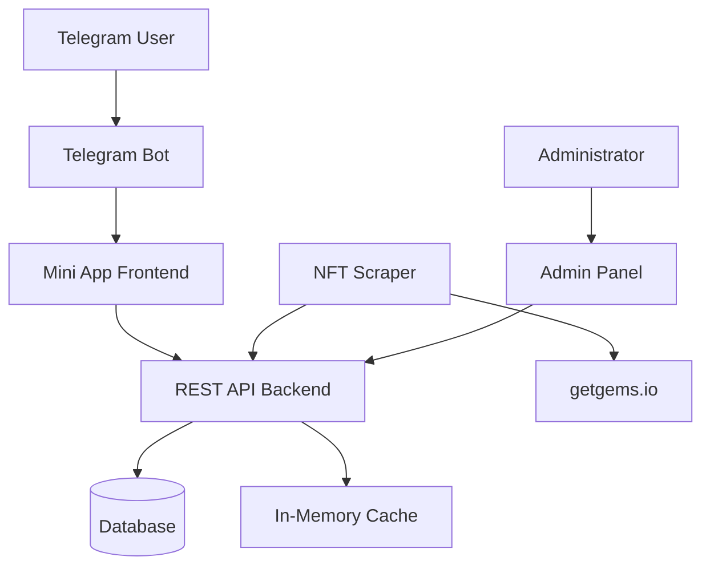
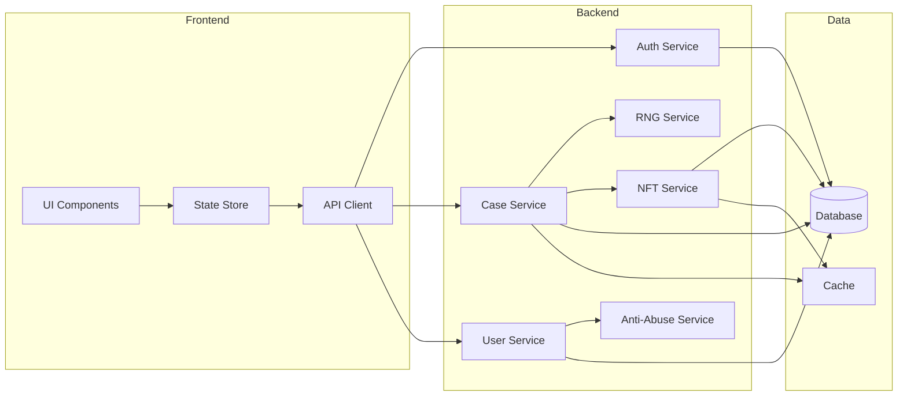
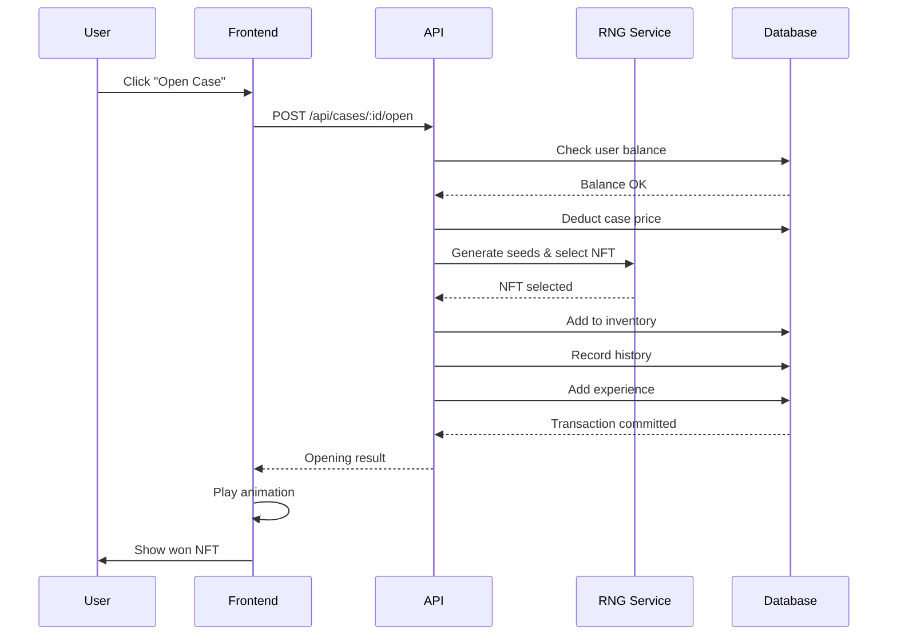
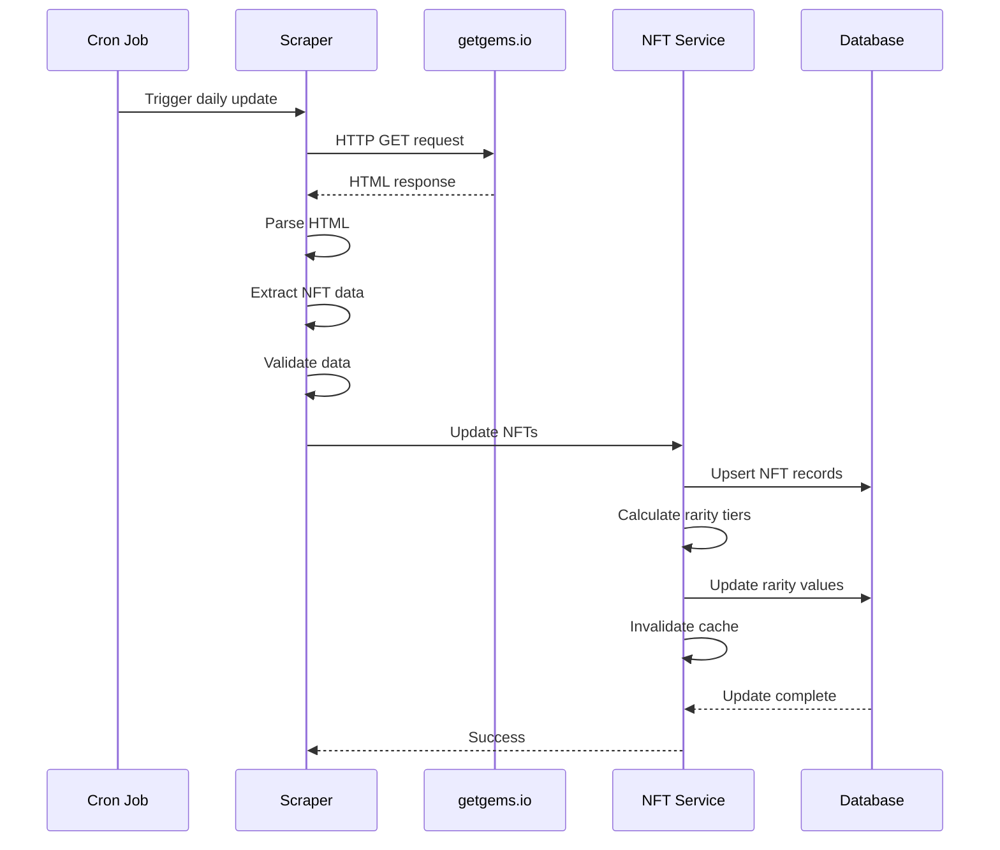
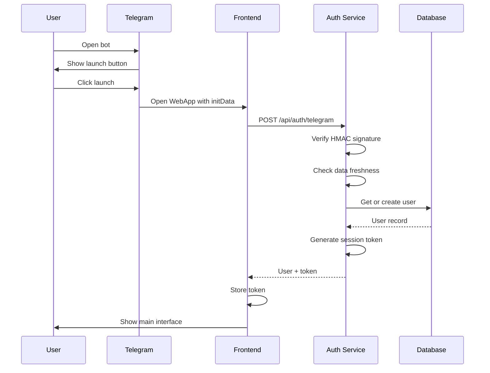

# Design Document: Telegram NFT Case Opener

## Overview

The Telegram NFT Case Opener is a Mini App that provides a gamified case-opening experience for Telegram NFT Gifts. The system operates entirely on free-tier infrastructure with zero recurring costs while delivering a premium user experience with smooth animations, glassmorphism UI, and provably fair mechanics.

### Core Functionality

- Telegram WebApp integration with bot-based authentication
- Automated NFT data scraping from getgems.io
- Dynamic rarity-based drop probability system
- Premium case opening animations (60fps reel/roulette)
- User inventory and balance management
- Provably fair RNG with seed verification
- Administrative panel for case and user management
- Anti-abuse detection and prevention

### Technology Stack

**Backend:**
- Runtime: Node.js 18+
- Framework: Express.js
- Bot Framework: Telegraf
- Database: SQLite (development) / Supabase (production, free tier)
- Scraping: Cheerio + Axios
- Authentication: Telegram WebApp signature verification

**Frontend:**
- Framework: React 18
- Build Tool: Vite
- Animation: Framer Motion
- Styling: Tailwind CSS + custom glassmorphism
- State Management: Zustand
- HTTP Client: Axios

**Hosting:**
- Backend: Render free tier (750 hours/month)
- Frontend: Vercel free tier
- Database: Supabase free tier (500MB, 2GB bandwidth)


## Architecture

### High-Level Architecture



### Component Architecture

**Three-Tier Architecture:**

1. **Presentation Layer** (Frontend)
   - React SPA with Telegram WebApp SDK
   - Framer Motion for animations
   - Zustand for state management
   - Responsive mobile-first design

2. **Application Layer** (Backend API)
   - Express.js REST API
   - Telegraf bot handlers
   - Business logic services
   - Authentication middleware
   - Rate limiting middleware

3. **Data Layer**
   - SQLite/Supabase database
   - In-memory cache for hot data
   - File system for static assets

### Service Architecture




## Components and Interfaces

### Backend Components

#### 1. Telegram Bot Service

**Responsibilities:**
- Handle bot commands (/start, /help)
- Launch Mini App with authentication
- Send notifications to users

**Interface:**
```typescript
interface TelegramBotService {
  start(): Promise<void>;
  sendWelcomeMessage(chatId: number): Promise<void>;
  launchMiniApp(chatId: number): Promise<void>;
  sendNotification(userId: number, message: string): Promise<void>;
}
```

**Implementation Details:**
- Uses Telegraf framework
- Webhook mode for production (free tier compatible)
- Polling mode for development
- Stores bot token in environment variable

#### 2. Authentication Service

**Responsibilities:**
- Verify Telegram WebApp init data
- Create/retrieve user sessions
- Validate admin access

**Interface:**
```typescript
interface AuthService {
  verifyTelegramAuth(initData: string): Promise<TelegramUser>;
  createOrUpdateUser(telegramUser: TelegramUser): Promise<User>;
  isAdmin(userId: number): boolean;
  generateSessionToken(userId: number): string;
}

interface TelegramUser {
  id: number;
  first_name: string;
  last_name?: string;
  username?: string;
  photo_url?: string;
}
```

**Implementation Details:**
- Validates HMAC signature using bot token
- Checks data freshness (max 24 hours old)
- Uses crypto.createHmac for signature verification
- Admin username stored in environment variable

#### 3. NFT Scraper Service

**Responsibilities:**
- Fetch NFT data from getgems.io
- Parse HTML/JSON responses
- Update database with new NFT information
- Handle rate limiting and retries

**Interface:**
```typescript
interface NFTScraperService {
  scrapeNFTs(): Promise<ScrapedNFT[]>;
  updateDatabase(nfts: ScrapedNFT[]): Promise<void>;
  schedulePeriodicUpdate(intervalHours: number): void;
}

interface ScrapedNFT {
  name: string;
  imageUrl: string;
  price: number;
  externalId: string;
}
```

**Implementation Details:**
- Uses Axios with custom headers (User-Agent, Accept)
- Cheerio for HTML parsing
- Exponential backoff: 1s, 2s, 4s, 8s, 16s
- Cron job runs daily at 3 AM UTC
- Validates data: non-empty name, valid URL, positive price


#### 4. NFT Service

**Responsibilities:**
- Manage NFT data and rarity classification
- Calculate rarity tiers based on price percentiles
- Provide NFT lookup and filtering

**Interface:**
```typescript
interface NFTService {
  getAllNFTs(): Promise<NFT[]>;
  getNFTById(id: number): Promise<NFT | null>;
  calculateRarityTiers(): Promise<void>;
  getNFTsByRarity(rarity: RarityTier): Promise<NFT[]>;
}

enum RarityTier {
  COMMON = 'common',
  RARE = 'rare',
  EPIC = 'epic',
  LEGENDARY = 'legendary'
}

interface NFT {
  id: number;
  name: string;
  imageUrl: string;
  price: number;
  rarity: RarityTier;
  lastUpdated: Date;
}
```

**Implementation Details:**
- Rarity calculation on NFT data update:
  - Sort NFTs by price
  - Common: 0-25th percentile
  - Rare: 25-50th percentile
  - Epic: 50-90th percentile
  - Legendary: 90-100th percentile
- Caches NFT list in memory (TTL: 1 hour)
- Invalidates cache on data update

#### 5. Case Service

**Responsibilities:**
- Manage case configurations
- Calculate drop probabilities
- Handle case opening logic
- Coordinate with RNG service

**Interface:**
```typescript
interface CaseService {
  getAllCases(): Promise<Case[]>;
  getCaseById(id: number): Promise<Case | null>;
  createCase(data: CreateCaseDTO): Promise<Case>;
  updateCase(id: number, data: UpdateCaseDTO): Promise<Case>;
  openCase(userId: number, caseId: number): Promise<CaseOpeningResult>;
  calculateDropProbabilities(caseId: number): Promise<void>;
}

interface Case {
  id: number;
  name: string;
  price: number;
  imageUrl: string;
  enabled: boolean;
  nfts: CaseNFT[];
}

interface CaseNFT {
  nftId: number;
  dropProbability: number;
}

interface CaseOpeningResult {
  nft: NFT;
  serverSeed: string;
  clientSeed: string;
  nonce: number;
  timestamp: Date;
}
```

**Implementation Details:**
- Drop probability calculation:
  - Group NFTs by rarity
  - Assign weights: Common 50%, Rare 30%, Epic 15%, Legendary 5%
  - Distribute evenly within each tier
  - If tier missing, redistribute proportionally
- Atomic transaction for case opening:
  1. Check user balance
  2. Deduct case price
  3. Generate RNG result
  4. Add NFT to inventory
  5. Record opening history
  6. Commit or rollback


#### 6. RNG Service (Provably Fair)

**Responsibilities:**
- Generate cryptographically secure random numbers
- Implement provably fair algorithm
- Store and verify seeds

**Interface:**
```typescript
interface RNGService {
  generateServerSeed(): string;
  generateClientSeed(): string;
  selectNFT(serverSeed: string, clientSeed: string, nonce: number, probabilities: CaseNFT[]): number;
  verifyResult(serverSeed: string, clientSeed: string, nonce: number, probabilities: CaseNFT[], expectedNftId: number): boolean;
  hashSeed(seed: string): string;
}
```

**Implementation Details:**
- Server seed: 64 random hex characters (crypto.randomBytes(32))
- Client seed: User ID + timestamp + random component
- Nonce: Incremental counter per user
- Algorithm:
  1. Combine: `hash = SHA256(serverSeed + clientSeed + nonce)`
  2. Convert first 8 hex chars to decimal: `result = parseInt(hash.substring(0, 8), 16)`
  3. Normalize: `normalized = result / 0xFFFFFFFF` (0-1 range)
  4. Map to NFT using cumulative probability distribution
- Store server seed hash before opening
- Reveal server seed after opening

#### 7. User Service

**Responsibilities:**
- Manage user accounts and balances
- Handle inventory operations
- Track user statistics and levels

**Interface:**
```typescript
interface UserService {
  getUser(userId: number): Promise<User | null>;
  createUser(telegramUser: TelegramUser): Promise<User>;
  updateBalance(userId: number, amount: number): Promise<void>;
  getInventory(userId: number): Promise<InventoryItem[]>;
  sellNFT(userId: number, inventoryItemId: number): Promise<void>;
  addExperience(userId: number, amount: number): Promise<LevelUpResult | null>;
  getOpeningHistory(userId: number, page: number): Promise<OpeningHistoryPage>;
}

interface User {
  id: number;
  telegramId: number;
  username: string;
  balance: number;
  level: number;
  experience: number;
  blocked: boolean;
  createdAt: Date;
}

interface InventoryItem {
  id: number;
  nft: NFT;
  acquiredAt: Date;
}

interface LevelUpResult {
  newLevel: number;
  rewardBalance: number;
}
```

**Implementation Details:**
- Initial balance: 1000 units
- Sell back fee: 10% (user receives 90% of NFT price)
- Level system:
  - XP per case: 10
  - Level threshold: `100 * currentLevel`
  - Level up reward: `50 * newLevel` balance
- Inventory sorted by rarity (Legendary → Common) then acquisition date


#### 8. Anti-Abuse Service

**Responsibilities:**
- Monitor user activity for suspicious patterns
- Flag and block abusive accounts
- Rate limiting enforcement

**Interface:**
```typescript
interface AntiAbuseService {
  checkCaseOpeningRate(userId: number): Promise<AbuseCheckResult>;
  checkBalanceIncrease(userId: number, amount: number): Promise<AbuseCheckResult>;
  flagAccount(userId: number, reason: string): Promise<void>;
  blockAccount(userId: number): Promise<void>;
  getAccountFlags(userId: number): Promise<AbuseFlag[]>;
}

interface AbuseCheckResult {
  allowed: boolean;
  reason?: string;
  flagged: boolean;
}

interface AbuseFlag {
  userId: number;
  reason: string;
  timestamp: Date;
  autoBlocked: boolean;
}
```

**Implementation Details:**
- Uses Redis-like in-memory store (or Supabase realtime)
- Sliding window counters:
  - Case openings: 50 per 60 seconds
  - Balance increase: 100,000 per 60 seconds
- Auto-block after 3 flags
- Admin notification via bot message
- Cleanup old flags after 7 days

#### 9. Admin Service

**Responsibilities:**
- Provide admin panel operations
- Generate statistics and reports
- Manage system configuration

**Interface:**
```typescript
interface AdminService {
  getStatistics(): Promise<SystemStatistics>;
  searchUsers(query: string): Promise<User[]>;
  blockUser(userId: number): Promise<void>;
  unblockUser(userId: number): Promise<void>;
  triggerNFTUpdate(): Promise<UpdateProgress>;
  exportCaseConfiguration(caseId: number): Promise<string>;
  importCaseConfiguration(config: string): Promise<Case>;
}

interface SystemStatistics {
  totalUsers: number;
  casesOpenedLast24h: number;
  totalCurrencyInCirculation: number;
  popularCases: CaseStats[];
  averageBalance: number;
}

interface CaseStats {
  caseId: number;
  caseName: string;
  openCount: number;
}
```

**Implementation Details:**
- Statistics cached for 60 seconds
- User search: fuzzy match on username, exact match on Telegram ID
- Configuration export: JSON with 2-space indentation
- Configuration import: validates schema and probabilities


### Frontend Components

#### 1. App Shell

**Responsibilities:**
- Initialize Telegram WebApp SDK
- Handle authentication flow
- Provide global layout and navigation

**Component Structure:**
```typescript
interface AppShellProps {
  children: React.ReactNode;
}

// Routes
const routes = [
  { path: '/', component: HomePage },
  { path: '/cases', component: CasesPage },
  { path: '/case/:id', component: CaseDetailPage },
  { path: '/inventory', component: InventoryPage },
  { path: '/history', component: HistoryPage },
  { path: '/profile', component: ProfilePage },
  { path: '/admin', component: AdminPanel },
];
```

#### 2. Case Opening Animation

**Responsibilities:**
- Render smooth 60fps reel animation
- Display motion blur and glow effects
- Trigger haptic feedback
- Show confetti for legendary drops

**Component Interface:**
```typescript
interface CaseOpeningAnimationProps {
  nfts: NFT[];
  winningNft: NFT;
  onComplete: () => void;
}
```

**Implementation Details:**
- Uses Framer Motion for animation
- Reel composition:
  - 50 NFT slots (winning NFT at position 25)
  - Each slot: 120px width + 16px gap
  - Total scroll distance: 3400px
- Animation timeline:
  - 0-1s: Fast acceleration (ease-in)
  - 1-4s: Deceleration (ease-out cubic-bezier)
  - 4-5s: Final settle with bounce
- Motion blur: CSS filter during movement
- Glow effect: Box-shadow based on rarity
  - Common: blue glow
  - Rare: purple glow
  - Epic: pink glow
  - Legendary: gold glow + confetti
- Haptic: `window.Telegram.WebApp.HapticFeedback.impactOccurred('heavy')`

#### 3. Glassmorphism Card

**Responsibilities:**
- Reusable card component with glass effect
- Hover animations
- Responsive sizing

**Component Interface:**
```typescript
interface GlassCardProps {
  children: React.ReactNode;
  variant?: 'default' | 'hover' | 'glow';
  className?: string;
}
```

**Styling:**
```css
.glass-card {
  background: rgba(255, 255, 255, 0.05);
  backdrop-filter: blur(10px);
  border: 1px solid rgba(255, 255, 255, 0.1);
  border-radius: 16px;
  box-shadow: 0 8px 32px rgba(0, 0, 0, 0.3);
}

.glass-card-hover:hover {
  background: rgba(255, 255, 255, 0.08);
  transform: translateY(-4px);
  transition: all 0.3s ease;
}
```


#### 4. State Management

**Store Structure:**
```typescript
interface AppState {
  user: User | null;
  cases: Case[];
  inventory: InventoryItem[];
  loading: boolean;
  error: string | null;
  
  // Actions
  setUser: (user: User) => void;
  updateBalance: (balance: number) => void;
  setCases: (cases: Case[]) => void;
  setInventory: (inventory: InventoryItem[]) => void;
  addToInventory: (item: InventoryItem) => void;
  removeFromInventory: (itemId: number) => void;
}
```

**Implementation:**
- Zustand for lightweight state management
- Persist user preferences in localStorage
- Optimistic updates for better UX
- Error boundaries for graceful failures

### API Endpoints

#### Authentication
- `POST /api/auth/telegram` - Verify Telegram WebApp auth data
  - Body: `{ initData: string }`
  - Response: `{ user: User, token: string }`

#### Cases
- `GET /api/cases` - Get all enabled cases
  - Response: `{ cases: Case[] }`
- `GET /api/cases/:id` - Get case details
  - Response: `{ case: Case }`
- `POST /api/cases/:id/open` - Open a case
  - Headers: `Authorization: Bearer <token>`
  - Response: `{ result: CaseOpeningResult }`

#### User
- `GET /api/user/profile` - Get user profile
  - Headers: `Authorization: Bearer <token>`
  - Response: `{ user: User }`
- `GET /api/user/inventory` - Get user inventory
  - Headers: `Authorization: Bearer <token>`
  - Response: `{ items: InventoryItem[] }`
- `POST /api/user/inventory/:id/sell` - Sell NFT
  - Headers: `Authorization: Bearer <token>`
  - Response: `{ newBalance: number }`
- `GET /api/user/history` - Get opening history
  - Headers: `Authorization: Bearer <token>`
  - Query: `?page=1&limit=20&rarity=legendary`
  - Response: `{ items: HistoryItem[], total: number }`

#### Admin (requires admin auth)
- `GET /api/admin/statistics` - Get system statistics
- `GET /api/admin/users` - Search users
  - Query: `?q=username`
- `POST /api/admin/users/:id/block` - Block user
- `POST /api/admin/users/:id/unblock` - Unblock user
- `POST /api/admin/nft/update` - Trigger NFT scraper
- `POST /api/admin/cases` - Create case
- `PUT /api/admin/cases/:id` - Update case
- `GET /api/admin/cases/:id/export` - Export configuration
- `POST /api/admin/cases/import` - Import configuration

#### RNG Verification
- `POST /api/verify` - Verify case opening result
  - Body: `{ serverSeed, clientSeed, nonce, caseId, nftId }`
  - Response: `{ valid: boolean }`


## Data Models

### Database Schema

#### Users Table
```sql
CREATE TABLE users (
  id INTEGER PRIMARY KEY AUTOINCREMENT,
  telegram_id INTEGER UNIQUE NOT NULL,
  username TEXT,
  first_name TEXT,
  last_name TEXT,
  balance INTEGER DEFAULT 1000,
  level INTEGER DEFAULT 1,
  experience INTEGER DEFAULT 0,
  blocked BOOLEAN DEFAULT FALSE,
  created_at TIMESTAMP DEFAULT CURRENT_TIMESTAMP,
  updated_at TIMESTAMP DEFAULT CURRENT_TIMESTAMP
);

CREATE INDEX idx_users_telegram_id ON users(telegram_id);
CREATE INDEX idx_users_username ON users(username);
```

#### NFTs Table
```sql
CREATE TABLE nfts (
  id INTEGER PRIMARY KEY AUTOINCREMENT,
  external_id TEXT UNIQUE,
  name TEXT NOT NULL,
  image_url TEXT NOT NULL,
  price INTEGER NOT NULL,
  rarity TEXT NOT NULL CHECK(rarity IN ('common', 'rare', 'epic', 'legendary')),
  last_updated TIMESTAMP DEFAULT CURRENT_TIMESTAMP,
  created_at TIMESTAMP DEFAULT CURRENT_TIMESTAMP
);

CREATE INDEX idx_nfts_rarity ON nfts(rarity);
CREATE INDEX idx_nfts_price ON nfts(price);
```

#### Cases Table
```sql
CREATE TABLE cases (
  id INTEGER PRIMARY KEY AUTOINCREMENT,
  name TEXT NOT NULL,
  description TEXT,
  price INTEGER NOT NULL,
  image_url TEXT,
  enabled BOOLEAN DEFAULT TRUE,
  created_at TIMESTAMP DEFAULT CURRENT_TIMESTAMP,
  updated_at TIMESTAMP DEFAULT CURRENT_TIMESTAMP
);

CREATE INDEX idx_cases_enabled ON cases(enabled);
```

#### Case_NFTs Table (Junction)
```sql
CREATE TABLE case_nfts (
  id INTEGER PRIMARY KEY AUTOINCREMENT,
  case_id INTEGER NOT NULL,
  nft_id INTEGER NOT NULL,
  drop_probability REAL NOT NULL CHECK(drop_probability >= 0 AND drop_probability <= 100),
  FOREIGN KEY (case_id) REFERENCES cases(id) ON DELETE CASCADE,
  FOREIGN KEY (nft_id) REFERENCES nfts(id) ON DELETE CASCADE,
  UNIQUE(case_id, nft_id)
);

CREATE INDEX idx_case_nfts_case_id ON case_nfts(case_id);
CREATE INDEX idx_case_nfts_nft_id ON case_nfts(nft_id);
```

#### Inventory Table
```sql
CREATE TABLE inventory (
  id INTEGER PRIMARY KEY AUTOINCREMENT,
  user_id INTEGER NOT NULL,
  nft_id INTEGER NOT NULL,
  acquired_at TIMESTAMP DEFAULT CURRENT_TIMESTAMP,
  FOREIGN KEY (user_id) REFERENCES users(id) ON DELETE CASCADE,
  FOREIGN KEY (nft_id) REFERENCES nfts(id) ON DELETE CASCADE
);

CREATE INDEX idx_inventory_user_id ON inventory(user_id);
CREATE INDEX idx_inventory_nft_id ON inventory(nft_id);
```

#### Opening_History Table
```sql
CREATE TABLE opening_history (
  id INTEGER PRIMARY KEY AUTOINCREMENT,
  user_id INTEGER NOT NULL,
  case_id INTEGER NOT NULL,
  nft_id INTEGER NOT NULL,
  server_seed TEXT NOT NULL,
  client_seed TEXT NOT NULL,
  nonce INTEGER NOT NULL,
  opened_at TIMESTAMP DEFAULT CURRENT_TIMESTAMP,
  FOREIGN KEY (user_id) REFERENCES users(id) ON DELETE CASCADE,
  FOREIGN KEY (case_id) REFERENCES cases(id) ON DELETE CASCADE,
  FOREIGN KEY (nft_id) REFERENCES nfts(id) ON DELETE CASCADE
);

CREATE INDEX idx_opening_history_user_id ON opening_history(user_id);
CREATE INDEX idx_opening_history_opened_at ON opening_history(opened_at);
```

#### Abuse_Flags Table
```sql
CREATE TABLE abuse_flags (
  id INTEGER PRIMARY KEY AUTOINCREMENT,
  user_id INTEGER NOT NULL,
  reason TEXT NOT NULL,
  auto_blocked BOOLEAN DEFAULT FALSE,
  created_at TIMESTAMP DEFAULT CURRENT_TIMESTAMP,
  FOREIGN KEY (user_id) REFERENCES users(id) ON DELETE CASCADE
);

CREATE INDEX idx_abuse_flags_user_id ON abuse_flags(user_id);
CREATE INDEX idx_abuse_flags_created_at ON abuse_flags(created_at);
```


### Data Flow Diagrams

#### Case Opening Flow


#### NFT Scraping Flow


#### Authentication Flow


